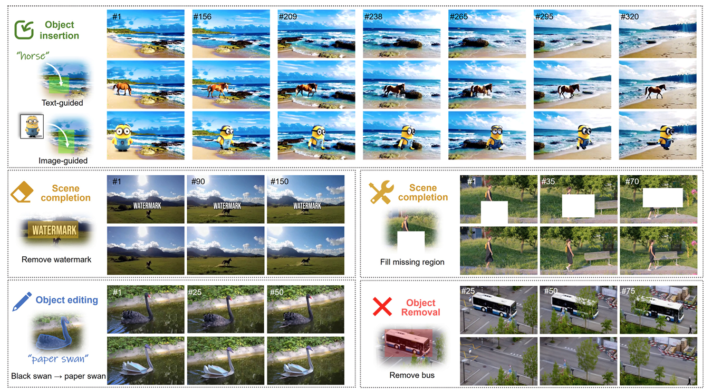

# MTV-Inpaint: Multi-task Long Video Inpainting

> Shiyuan Yang1,3, [Zheng Gu](https://edward3862.github.io/)4, [Liang Hou](https://liang-hou.github.io/)2, [Xin Tao](https://www.xtao.website/)2, [Pengfei Wan](https://scholar.google.com/citations?user=P6MraaYAAAAJ&hl=en)2, [Xiaodong Chen](https://faculty.tju.edu.cn/ChenXiaodong/en/index.htm)3, [Jing Liao](https://www.cityu.edu.hk/stfprofile/jingliao.htm)1

1City University of Hong Kong, 2Kuaishou Technology, 3Tianjin University, 4Shenzhen University

[![Project](https://img.shields.io/badge/MTV_Inpaint-1?label=Project&logo=data:image/svg+xml;charset=utf-8;base64,PHN2ZyB0PSIxNzEyNDkwMTA3NzIxIiBjbGFzcz0iaWNvbiIgdmlld0JveD0iMCAwIDEwMjkgMTAyNCIgdmVyc2lvbj0iMS4xIiB4bWxucz0iaHR0cDovL3d3dy53My5vcmcvMjAwMC9zdmciIHAtaWQ9IjM4NzUiIHdpZHRoPSIyMDAiIGhlaWdodD0iMjAwIj48cGF0aCBkPSJNMTAwMS40MjMyMzggNDk0LjU5MnEyMS41MDQgMjAuNDggMjIuNTI4IDQ1LjA1NnQtMTYuMzg0IDQwLjk2cS0xOS40NTYgMTcuNDA4LTQ1LjA1NiAxNi4zODR0LTQwLjk2LTE0LjMzNnEtNS4xMi00LjA5Ni0zMS4yMzItMjguNjcydC02Mi40NjQtNTguODgtNzcuODI0LTczLjcyOC03OC4zMzYtNzQuMjQtNjMuNDg4LTYwLjQxNi0zMy43OTItMzEuNzQ0cS0zMi43NjgtMjkuNjk2LTY0LjUxMi0yOC42NzJ0LTYyLjQ2NCAyOC42NzJxLTEwLjI0IDkuMjE2LTM4LjQgMzUuMzI4dC02NS4wMjQgNjAuOTI4LTc3LjgyNCA3Mi43MDQtNzUuNzc2IDcwLjY1Ni01OS45MDQgNTUuODA4LTMwLjIwOCAyNy4xMzZxLTE1LjM2IDEyLjI4OC00MC45NiAxMy4zMTJ0LTQ0LjAzMi0xNS4zNnEtMjAuNDgtMTguNDMyLTE5LjQ1Ni00NC41NDR0MTcuNDA4LTQxLjQ3MnE2LjE0NC02LjE0NCAzNy44ODgtMzUuODR0NzUuNzc2LTcwLjY1NiA5NC43Mi04OC4wNjQgOTQuMjA4LTg4LjA2NCA3NC43NTItNzAuMTQ0IDM2LjM1Mi0zNC4zMDRxMzguOTEyLTM3Ljg4OCA4My45NjgtMzguNHQ3Ni44IDMwLjIwOHE2LjE0NCA1LjEyIDI1LjYgMjQuMDY0dDQ3LjYxNiA0Ni4wOCA2Mi45NzYgNjAuOTI4IDcwLjY1NiA2OC4wOTYgNzAuMTQ0IDY4LjA5NiA2Mi45NzYgNjAuOTI4IDQ4LjEyOCA0Ni41OTJ6TTQ0Ny40MzkyMzggMzQ2LjExMnEyNS42LTIzLjU1MiA2MS40NC0yNS4wODh0NjQuNTEyIDI1LjA4OHEzLjA3MiAzLjA3MiAxOC40MzIgMTcuNDA4bDM4LjkxMiAzNS44NHEyMi41MjggMjEuNTA0IDUwLjY4OCA0OC4xMjh0NTcuODU2IDUzLjI0OHE2OC42MDggNjMuNDg4IDE1My42IDE0Mi4zMzZsMCAxOTQuNTZxMCAyMi41MjgtMTYuODk2IDM5LjkzNnQtNDUuNTY4IDE4LjQzMmwtMTkzLjUzNiAwIDAtMTU4LjcycTAtMzMuNzkyLTMxLjc0NC0zMy43OTJsLTE5NS41ODQgMHEtMTcuNDA4IDAtMjQuMDY0IDEwLjI0dC02LjY1NiAyMy41NTJxMCA2LjE0NC0wLjUxMiAzMS4yMzJ0LTAuNTEyIDUzLjc2bDAgNzMuNzI4LTE4Ny4zOTIgMHEtMjkuNjk2IDAtNDcuMTA0LTEzLjMxMnQtMTcuNDA4LTM3Ljg4OGwwLTIwMy43NzZxODMuOTY4LTc2LjggMTUyLjU3Ni0xMzkuMjY0IDI4LjY3Mi0yNi42MjQgNTcuMzQ0LTUyLjczNnQ1Mi4yMjQtNDcuNjE2IDM5LjQyNC0zNi4zNTIgMTkuOTY4LTE4Ljk0NHoiIHAtaWQ9IjM4NzYiIGZpbGw9IiNmZmZmZmYiPjwvcGF0aD48L3N2Zz4=)](https://mtv-inpaint.github.io/)

<!--  -->

> **The code is under preparation and will be released upon paper acceptance : )**

> **TL;DR:** MTV-Inpaint is a unified video inpainting framework that supports multiple tasks, such as text/image-guided object insertion, scene completion, and derived applications like object editing and removal. It is also capable of handling long videos with hundreds of frames.

